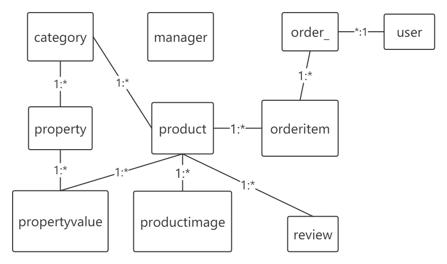

# tmall
[toc]
## 简介
这是一个购物商城项目 
后台技术使用的是SpringBoot，前端使用的是jsp; 
有一个完整的业务流程  
加入购物车->下单->付款->商家发货->确认收货->评价 
数据库是tmall，所有的表信息在文件**tmall.sql**中 
数据库中有 
用户表、订单表、订单项表、产品表、产品图片表、属性值表、评价表、分类表、属性表、管理者表 
 
**2.0** 版本有一个完整的业务流程 稳定运行 基础前端业务线，后台各表CRUD 
**2.1** 版本支持RestFul风格 
## 下载运行
从IDEA 上clone 项目到本地
**环境**
mysql 5.x
jdk 8
**在application.properties中修改mysql的配置**
> MySQL数据库配置

spring.datasource.url=jdbc:mysql://127.0.0.1:3306/*****?characterEncoding=UTF-8
spring.datasource.username=root
spring.datasource.password=*****
spring.datasource.driver-class-name=com.mysql.jdbc.Driver
将tmall.sql导入到自己的数据库中

**启动**
前端访问 localhost:8081/test/
后台访问 localhost:8081/test/admin

**登入问题**
前端可以注册然后进行登入，后台也会有数据查看即可
后台账号数据请到数据库中查看
